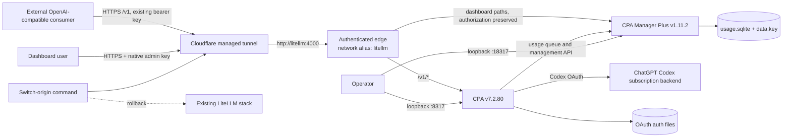

# CPA and CPA Manager Plus Migration Plan

## Metadata

- Project name: CLIProxyAPI Setup
- Version: 1.0.0
- Owners: Kirill Igumenshchev; implementation agent; operations reviewer
- Date: 2026-07-16
- Document ID: CPASETUP-PLAN-001
- Status: Implemented with the 2026-07-16 authenticated-dashboard amendment
- Standards tailoring: This plan is informed by ISO/IEC/IEEE 29148 requirements practices, ISO/IEC/IEEE 29119-3 test documentation practices, and ISO/IEC/IEEE 12207 implementation lifecycle practices. It is not a claim of standards certification or safety-critical compliance.

This plan defines a parallel deployment and reversible cutover from the existing LiteLLM ChatGPT-subscription gateway to CLIProxyAPI (CPA) with CPA Manager Plus (CPAMP). The delivered system preserves the existing OpenAI-compatible public base URL, bearer credential, and `gpt-5.4-mini` model contract while fixing the loss of Responses API `text.format` JSON Schema enforcement, preserving `web_search`, recording usage, and retaining LiteLLM as an offline rollback target during stabilization.

## Design consensus and trade-offs

| Topic | Verdict | Rationale |
|---|---|---|
| CPA versus patching LiteLLM first | DECISION | CPA v7.2.80 preserves the Responses `text` subtree through targeted request mutation. The deployed LiteLLM ChatGPT Responses adapter omits `text` from its allowlist. CPA validation and cutover therefore precede work on LiteLLM issue `kirilligum/litellm-chatgpt#2`. |
| CPAMP versus CPA Usage Keeper | FOR CPAMP | CPAMP provides usage persistence, request monitoring, quota/account health, and CPA management in one service. CPA Usage Keeper remains active but would add a narrower second operational surface. |
| Parallel deployment | FOR | CPA and CPAMP must pass local contracts before public traffic moves. LiteLLM remains running without the active tunnel connector so rollback does not require rebuilding it. |
| Immutable images | FOR | `eceasy/cli-proxy-api:v7.2.80` resolves to index digest `sha256:6f5bcee0c3b8d0536f4a3f0f5cb9fd0b7d2e17196dd40d30f11aec9cc2f5f161`; `seakee/cpa-manager-plus:v1.11.2` resolves to `sha256:5897b299887dbe7a8fa2e23850fe64949e5a60a94ba5e5aebd3acd810e710351`. Deployment uses digests, not floating tags. |
| Public hostname and consumer key | DECISION | Preserve `https://litellm.prls.co/v1`, model `gpt-5.4-mini`, and the existing bearer key. This limits consumer changes and permits rollback at the origin. |
| Cloudflare tunnel routing | DECISION | While CPA is active, the remotely managed tunnel retains `litellm.prls.co -> http://litellm:4000`. The `litellm` alias belongs to an edge sidecar that passes `/v1/*` to CPA and sends other authenticated paths to CPAMP. CPA host access remains `127.0.0.1:8317`. Exactly one old or new connector runs during an API-origin switch. |
| Management exposure | NATIVE ADMIN-KEY AUTH | CPA host port `8317` and the raw CPAMP host port `18317` remain loopback-only. `https://litellm.prls.co/management.html` loads publicly, while CPAMP itself requires its native admin key for management API access. The key is mirrored into `CPAMP_ADMIN_KEY` in the ignored mode-`0600` `.env`; no second proxy login is configured. This 2026-07-16 operator authorization supersedes the original private-dashboard decision. |
| Subscription authentication | FOR Codex OAuth only | The gateway uses `-codex-device-login` and persisted OAuth auth files. No OpenAI API key provider is configured, preventing accidental per-token billing fallback. |
| Request mutation | DECISION | Set `disable-image-generation: passthrough`; preserve client tools instead of default image-tool injection. CPA may still force supported Codex transport fields such as streaming and storage behavior. |
| Schema and web search acceptance | DECISION | Cutover requires strict JSON Schema, stable `web_search`, and their combined use to pass without downstream JSON repair. |
| Secret reuse | DECISION | Import the current LiteLLM bearer key without printing it; generate distinct CPA management and CPAMP admin keys. Tracked files contain paths and variable names only. |
| LiteLLM fallback patch | AGAINST current scope | Issue `kirilligum/litellm-chatgpt#2` tracks adding `text` to the LiteLLM allowlist. That patch is not a prerequisite for CPA cutover and is excluded from this repository's implementation scope. |

## PRD / stakeholder and system needs

### Problem

The current LiteLLM `chatgpt/` Responses adapter reconstructs a valid OpenAI Responses request and then removes the top-level `text` field through a restrictive allowlist. Strict `text.format.type=json_schema` requests consequently reach the subscription backend as plain text requests. This causes non-conforming output, downstream repair, and failed structured-output workloads. The replacement must continue using ChatGPT subscription entitlement rather than an OpenAI API key and must preserve the external consumer contract.

### Users

- External OpenAI-compatible consumers using `https://litellm.prls.co/v1`.
- The server operator managing OAuth credentials, quotas, failures, and upgrades.
- Maintainers diagnosing request transformations and structured-output failures.

### Value

- Enforced JSON Schema output without per-token API billing.
- Reversible migration with no consumer URL, model, or credential rotation.
- Persistent request, token, latency, status, and quota observability.
- Reproducible deployment with pinned artifacts and recovery procedures.

### Business goals

- Remove schema-loss failures from subscription-backed `gpt-5.4-mini` traffic.
- Avoid a second analytics-only companion when CPAMP covers the required operations.
- Keep public cutover and rollback bounded to a single connector transition.
- Produce auditable requirements, commands, test evidence, and configuration checkpoints.

### Success metrics

- Strict schema conformance: 10/10 responses validate against the submitted schema.
- Stable web search: 5/5 fixed-contract requests complete with a web-search call and schema-valid final output.
- Usage collection completeness: 5/5 tagged requests appear in CPAMP.
- CPAMP insertion lag: p95 at or below 10 seconds.
- Public cutover or rollback recovery: at or below 120 seconds per transition.
- Secret leakage: zero secret values in tracked files, test output, Compose rendering, or retained application logs.
- Image provenance: 100% of runtime images use recorded immutable digests.

### Scope

- Repository command and test harness.
- Pinned Docker Compose services for CPA, CPAMP, and the existing Cloudflare tunnel connector.
- Ignored local state for configuration, auth, secrets, logs, SQLite, and backups.
- Codex device OAuth and `gpt-5.4-mini` model verification.
- Responses API contract, observability, cutover, rollback, restart, and recovery tests.
- Operator documentation and systemd startup integration.

### Non-goals

- Modifying upstream CPA, CPAMP, or LiteLLM source.
- Implementing LiteLLM issue `kirilligum/litellm-chatgpt#2`.
- Adding non-Codex providers or pay-per-token OpenAI credentials.
- Exposing unauthenticated CPAMP or any CPA management endpoint publicly.
- Migrating historical LiteLLM usage into CPAMP.
- Claiming byte-for-byte CPA request passthrough; acceptance concerns the documented fields and observable contracts.

### Dependencies

- Docker Engine 29.1.3 and Docker Compose 2.40.3 or compatible later patch versions.
- Existing `/home/kirill/p/litellm-chatgpt/.env` containing the current bearer key and tunnel token.
- Existing remotely managed Cloudflare tunnel `shaman-litellm` and its connector token.
- Interactive ChatGPT/Codex device authorization by the account owner.
- Internet access to ChatGPT/Codex, Docker registries, and Cloudflare.
- `bash`, `curl`, `jq`, `openssl`, `python3`, `tar`, `git`, and `docker` on the host.

### Risks

- CPA or the subscription backend may reject combined web search and JSON Schema.
- Two cloudflared connectors could briefly distribute traffic across different gateways.
- OAuth credentials may expire, be revoked, or expose a different model catalog.
- CPAMP may be healthy while its usage collector is unconfigured or stalled.
- Copying the consumer key may leak it through shell tracing or logs.
- SQLite and its encryption key may become unrecoverable if backed up inconsistently.
- Rapid upstream release cadence may tempt unreviewed image updates.

### Assumptions

- The host architecture remains `linux/amd64`.
- CPA v7.2.80 continues to expose OpenAI-compatible `/v1/models` and `/v1/responses`.
- CPAMP v1.11.2 supports CPA v7.2.80 and environment-managed connection secrets.
- The Cloudflare tunnel token remains valid and its remote origin remains `http://litellm:4000`.
- The external consumer accepts forced streaming behavior already used by the current subscription gateway.

## SRS / canonical requirements

### Functional requirements

- REQ-001 (`func`): The system shall proxy subscription-backed `gpt-5.4-mini` requests through CPA without configuring a pay-per-token OpenAI provider.
  - Acceptance criteria: An authenticated model request completes through a persisted Codex OAuth account, and configuration contains no OpenAI API key provider.
- REQ-002 (`func`): The system shall expose `gpt-5.4-mini` through `/v1/models` and `/v1/responses` using the existing client-facing model name.
  - Acceptance criteria: The catalog contains the model and a basic streaming response completes.
- REQ-003 (`func`): The system shall preserve and enforce Responses `text.format.type=json_schema`, including `name`, `strict`, and `schema`.
  - Acceptance criteria: Completed metadata reports `json_schema` and output validates without repair.
- REQ-004 (`func`): The system shall preserve stable `web_search` requests and support combined web search with strict JSON Schema.
  - Acceptance criteria: Fixed requests produce a web-search call and schema-valid output.
- REQ-005 (`func`): CPAMP shall collect and persist CPA request usage with model, status, token, latency, and account-health visibility.
  - Acceptance criteria: Tagged requests increase persisted event count and produce non-empty collection timestamps.
- REQ-006 (`func`): The operator shall be able to switch the public tunnel between CPA and LiteLLM with one repository command per direction.
  - Acceptance criteria: Each command serializes connector ownership, probes the selected backend, and automatically restores the previous connector after a failed probe.

### Non-functional requirements

- REQ-007 (`security`): CPA and raw CPAMP management surfaces shall bind only to loopback on the host; the public dashboard page may load without proxy authentication, but CPAMP management APIs shall require CPAMP's native admin key mirrored into the ignored `.env`.
  - Acceptance criteria: Raw host mappings use `127.0.0.1`; the dashboard page returns `200`; unauthenticated and invalid public status calls return `401`; a valid `CPAMP_ADMIN_KEY` status call succeeds.
- REQ-008 (`security`): Secrets and OAuth material shall remain untracked, mode-restricted, and absent from emitted command and log evidence.
  - Acceptance criteria: Secret files are mode `0600`, state directories are ignored, and scans find no tracked or logged secret values.
- REQ-009 (`reliability`): CPA, CPAMP, and the active tunnel connector shall restart after process or host-service restart while preserving auth and usage state.
  - Acceptance criteria: Restart retains model availability, OAuth auth files, CPAMP event count, and the selected-origin marker.
- REQ-010 (`reliability`): The deployment shall provide consistent backup and restore for CPA auth/configuration and CPAMP SQLite plus its data key.
  - Acceptance criteria: A backup can be restored into an isolated path with matching manifest hashes and required modes.
- REQ-011 (`perf`): CPAMP shall persist accepted usage events with p95 lag at or below 10 seconds under the defined five-request evaluation workload.
  - Acceptance criteria: All events arrive and measured p95 remains within the frozen threshold.
- REQ-012 (`reliability`): Public cutover and rollback shall restore a passing public health and basic response contract within 120 seconds.
  - Acceptance criteria: Two controlled transitions meet the frozen threshold without concurrent old and new connectors.
- REQ-013 (`nfr`): Runtime container images shall be pinned by immutable multi-architecture digest and configuration rendering shall be deterministic.
  - Acceptance criteria: Compose contains no floating runtime image and repeated rendering produces identical normalized output.
- REQ-014 (`nfr`): Every repository verification artifact shall be callable through documented deterministic commands and carry grep-able traceability tags.
  - Acceptance criteria: Static validation finds the required tags, commands, fixtures, timeouts, and pass criteria surfaces.
- REQ-015 (`reliability`): CPA shall not inject or remove `image_generation` on non-image Responses requests.
  - Acceptance criteria: Configuration selects passthrough mode and contract evidence contains only client-supplied tools.

### Interface/API requirements

- REQ-016 (`int`): The public interface shall remain `https://litellm.prls.co/v1`, bearer authentication, and model `gpt-5.4-mini`.
  - Acceptance criteria: The external consumer contract passes after cutover without URL, key, or model changes.
- REQ-017 (`int`): Interfaces shall be CPA `http://127.0.0.1:8317`, raw CPAMP `http://127.0.0.1:18317`, authenticated proxy `http://127.0.0.1:18417`, public dashboard `https://litellm.prls.co/management.html`, and private Compose CPA endpoint `http://cli-proxy-api:4000`.
  - Acceptance criteria: Expected listeners respond and no management port listens on a non-loopback host address.

### Data requirements

- REQ-018 (`data`): Persisted data shall separate CPA auth/config/log data, CPAMP SQLite/data key, secrets, test evidence, and backups.
  - Acceptance criteria: Each class has a defined path, retention rule, permission rule, and backup treatment.
- REQ-019 (`data`): Usage validation shall correlate requests using non-secret test identifiers rather than prompt or credential contents.
  - Acceptance criteria: Each evaluation request has a unique correlation identifier visible in local evidence and no secret-bearing fields.

### Error handling and telemetry expectations

- Authentication errors return a non-2xx OpenAI-compatible error without credential material.
- Unsupported schema or tool combinations fail the phase gate; they are not silently downgraded to plain text.
- CPAMP collector status exposes `configured`, `collector.lastError`, `lastConsumedAt`, `lastInsertedAt`, and `eventCount` for automated polling.
- Cutover failure triggers automatic restoration of the previously active connector and records timestamps and probe results.
- Test scripts redact bearer values, never enable `set -x`, and write sanitized evidence under `artifacts/`.

### Architecture diagram



```text
System Context
┌──────────────────────────────────────────────────────────────────┐
│ External consumer                                                │
│  HTTPS https://litellm.prls.co/v1, Bearer, gpt-5.4-mini          │
└──────────────────────────────┬───────────────────────────────────┘
                               │
┌──────────────────────────────▼───────────────────────────────────┐
│ Cloudflare managed tunnel: exactly one active connector          │
│  origin contract: authenticated edge at http://litellm:4000      │
└──────────────────────────────┬───────────────────────────────────┘
                               │
┌──────────────────────────────▼───────────────────────────────────┐
│ CLIProxyAPI Setup                                                │
│  Edge alias litellm:4000                                         │
│    /v1/* ──> CPA:4000 ──OAuth──> Codex subscription             │
│    other authenticated paths ──> CPAMP:18317                     │
│       │ usage/management                                         │
│       ▼                                                          │
│  CPAMP:18317 ──> usage.sqlite + data.key                         │
│  Host-only: CPA :8317; raw CPAMP :18317; edge :18417            │
└──────────────────────────────┬───────────────────────────────────┘
                               │ rollback command
┌──────────────────────────────▼───────────────────────────────────┐
│ Existing /home/kirill/p/litellm-chatgpt stack                   │
│  kept stopped from public tunnel while CPA is active             │
└──────────────────────────────────────────────────────────────────┘
```

## Iterative implementation and test plan

### Implementation strategy

- P00 creates the repository command and evidence contract before runtime configuration.
- P01 creates a renderable, pinned, secret-safe parallel stack without public traffic.
- P02 establishes subscription OAuth and model availability.
- P03 validates structured output, web search, and request-mutation constraints.
- P04 activates CPAMP persistence and telemetry.
- P05 transfers the existing public tunnel through a tested reversible state machine.
- P06 proves restart, backup, restore, and operating documentation.

### Compute controls

```yaml
branch_limits:
  implementation: 1
  diagnostic_experiments: 2
reflection_passes: 2
early_stop_percent: 95
early_stop_rule: Stop an evaluation after 95% of samples only when the remaining samples cannot change its pass or fail result; otherwise complete all samples.
concurrency:
  contract_requests: 1
  usage_requests: 1
  public_cutover_probes: 1
```

### Risk register

| Risk | Trigger | Mitigation |
|---|---|---|
| Schema silently downgraded | Completed format is `text` or output fails validation | Stop before cutover; retain raw sanitized SSE; compare CPA transformation and backend response. |
| Web search/schema incompatibility | Missing search call or non-schema final output | Stop P03 and open a minimized CPA issue with fixture and version evidence. |
| Accidental API billing | OpenAI API provider or key appears in config/auth | Remove provider, rotate exposed material, repeat security and auth tests. |
| Split tunnel traffic | Old and new cloudflared connectors overlap | Switch script stops and confirms the prior connector before starting the selected connector. |
| CPAMP data loss | SQLite copied without WAL or data key | Stop CPAMP for backup; hash SQLite family and data key; execute isolated restore test. |
| Secret disclosure | Secret value appears in tracked file, output, or logs | Suspend work, remove evidence, rotate affected credentials, and resume from the last clean checkpoint. |
| OAuth revocation | Catalog or request returns authentication failure | Repeat device login; preserve prior auth file backup; do not add billed fallback. |
| Upstream image drift | Digest differs from recorded value | Block pull, create ADR for version change, repeat all affected tests and evaluations. |

### Suspension and resumption criteria

- Suspend on secret disclosure, concurrent tunnel connectors, missing OAuth authority, digest mismatch, unexplained paid-provider configuration, or a non-deterministic contract failure.
- Resume only after the triggering state is removed, credentials are rotated when applicable, evidence is recorded, and the last passing phase command succeeds again.
- Stop the migration if strict schema or subscription-only operation requires changing the public API contract.
- Escalate when an upstream contract cannot be reproduced with a minimized fixture or when a threshold change would be required without an approved ADR.

### Phase P00: A deterministic repository verification surface exists

- Phase goal: Establish the repository structure, command manifest, traceability validator, and evidence conventions used by all later phases.
- Scope and objectives: REQ-013, REQ-014, REQ-018.
- Impacted surfaces: `Makefile`, `.gitignore`, `README.md`, `scripts/`, `tests/static/`, `tests/eval/`, `artifacts/`, `state/`, `backups/`.
- Lifecycle evidence:
  - Requirements evidence: Metadata, requirements list, and TEST tag policy.
  - Design/code surface evidence: Initial repository tree and Make targets.
  - Verification method: TEST-001 and EVAL-001.
  - Validation purpose: Prove later commands and evidence are discoverable and deterministic.
  - Configuration checkpoint: Commit containing only harness, documentation, and ignored-directory rules.
  - Risks and assumptions: Host utilities listed under Dependencies are available.
- Plan-and-Solve subtasks:
  - `P00.S01 Add failing coverage for the repository contract`
    - Action: Create `tests/static/test_repository_contract.sh` with `# TEST-001`; assert the required initial paths, Make targets, executable bits, and traceability tags.
    - Why now: No project command can be trusted before its required surface is specified.
    - Files/surfaces: `tests/static/test_repository_contract.sh`.
    - Requirement link: REQ-014, REQ-018.
    - Verification link: TEST-001.
    - Verification mode: RED.
    - Command/procedure: `bash tests/static/test_repository_contract.sh`.
    - Expected result: Non-zero exit listing missing repository surfaces.
    - Evidence produced: RED transcript at `artifacts/P00/TEST-001-red.txt`.
    - Stop/escalate condition: The test exposes secret values or depends on an unavailable non-declared tool.
    - Unlocks: P00.S02.
  - `P00.S02 Create the repository command and evidence skeleton`
    - Action: Add the documented directories, `Makefile`, `README.md`, and ignore rules; define `test-static`, `test-local`, `test-contract`, `test-observability`, `test-public`, `eval`, and `verify` targets without executing missing later suites.
    - Why now: TEST-001 provides failing coverage for this structural implementation.
    - Files/surfaces: `Makefile`, `README.md`, `.gitignore`, `scripts/README.md`, `tests/README.md`, `artifacts/.gitkeep`, `state/.gitignore`, `backups/.gitignore`.
    - Requirement link: REQ-013, REQ-014, REQ-018.
    - Verification link: TEST-001.
    - Verification mode: GREEN.
    - Command/procedure: `bash tests/static/test_repository_contract.sh`.
    - Expected result: Exit zero with every initial surface and traceability rule present.
    - Evidence produced: GREEN transcript at `artifacts/P00/TEST-001-green.txt` and repository tree diff.
    - Stop/escalate condition: A Make target would conceal a missing command or mutate external services by default.
    - Unlocks: P00.S03.
  - `P00.S03 Record that no harness refactor is needed`
    - Action: Review the small shell harness for duplication and retain direct commands because each test has one responsibility.
    - Why now: The GREEN structure must be stable before measuring repeatability.
    - Files/surfaces: `tests/static/test_repository_contract.sh`, `Makefile`.
    - Requirement link: REQ-014.
    - Verification link: TEST-001.
    - Verification mode: VERIFY.
    - Command/procedure: `bash tests/static/test_repository_contract.sh`.
    - Expected result: Exit zero; evidence states `No refactor needed` because the harness has no duplicated parsing or service logic.
    - Evidence produced: Review note at `artifacts/P00/refactor-review.md`.
    - Stop/escalate condition: Repeated shell logic exceeds one shared operation and warrants `scripts/lib/` extraction.
    - Unlocks: P00.S04.
  - `P00.S04 Measure harness repeatability`
    - Action: Create and execute a three-run evaluator that hashes normalized TEST-001 output.
    - Why now: Repeatability is the exit condition for the verification surface.
    - Files/surfaces: `tests/eval/harness_reproducibility.sh`, `artifacts/P00/`.
    - Requirement link: REQ-013, REQ-014.
    - Verification link: EVAL-001.
    - Verification mode: MEASURE.
    - Command/procedure: `bash tests/eval/harness_reproducibility.sh`.
    - Expected result: Three successful runs and one unique normalized output hash.
    - Evidence produced: `artifacts/P00/EVAL-001.json`.
    - Stop/escalate condition: Output differs across unchanged runs.
    - Unlocks: Phase P00 exit.
- Exit gates:
  - Proceed: TEST-001 and EVAL-001 pass and all initial surfaces are traceable.
  - Escalate: A required host tool is absent or output normalization is unstable.
  - Stop: The repository cannot provide a non-mutating default verification command.
- Phase metrics:
  - Confidence %: 95; the repository is empty and the required structure is controlled locally.
  - Long-term robustness %: 90; explicit commands and tags reduce verification drift.
  - Internal interactions: 8 file surfaces.
  - External interactions: 0.
  - Complexity %: 18; shell structure only.
  - Feature creep %: 3; all surfaces support later gates.
  - Technical debt %: 5; direct shell is acceptable at this size.
  - YAGNI score: 96; no runtime abstraction is introduced.
  - MoSCoW: Must.
  - Local/non-local scope: Local only.
  - Architectural changes count: 1.

### Phase P01: A pinned and secret-safe parallel stack renders locally

- Phase goal: Produce a deterministic CPA, CPAMP, and optional tunnel Compose stack without starting public traffic.
- Scope and objectives: REQ-007, REQ-008, REQ-013, REQ-015, REQ-017, REQ-018.
- Impacted surfaces: `compose.yaml`, `config/cpa/config.yaml.template`, `.env.example`, `scripts/init-state.sh`, `scripts/import-existing-secrets.sh`, `scripts/render-cpa-config.py`, `tests/static/test_compose_contract.sh`, `tests/security/secret_hygiene.sh`.
- Lifecycle evidence:
  - Requirements evidence: Image digests, port bindings, secret classes, and passthrough configuration.
  - Design/code surface evidence: Normalized Compose output and generated ignored config.
  - Verification method: TEST-002, TEST-004, and EVAL-002.
  - Validation purpose: Prove deployment shape and secrets are safe before containers start.
  - Configuration checkpoint: Commit containing Compose, templates, scripts, and tests but no runtime state.
  - Risks and assumptions: Existing sibling `.env` has the named values and is never printed.
- Plan-and-Solve subtasks:
  - `P01.S01 Add failing coverage for pinned Compose topology`
    - Action: Create TEST-002 assertions for exact digests, loopback mappings, private network alias `litellm`, CPA container port `4000`, CPAMP persistence, health probes, and a non-default public profile for cloudflared.
    - Why now: Topology coverage must precede Compose implementation.
    - Files/surfaces: `tests/static/test_compose_contract.sh`.
    - Requirement link: REQ-007, REQ-013, REQ-015, REQ-017.
    - Verification link: TEST-002.
    - Verification mode: RED.
    - Command/procedure: `bash tests/static/test_compose_contract.sh`.
    - Expected result: Non-zero exit because `compose.yaml` and CPA template do not exist.
    - Evidence produced: `artifacts/P01/TEST-002-red.txt`.
    - Stop/escalate condition: Docker Compose cannot parse the proposed digest syntax on the installed version.
    - Unlocks: P01.S02.
  - `P01.S02 Implement the pinned Compose topology`
    - Action: Add CPA, CPAMP, and profiled cloudflared services; pin the recorded digests; bind host ports to loopback; map CPA host `8317` to container `4000`; add alias `litellm`; mount ignored state paths.
    - Why now: TEST-002 defines the required topology.
    - Files/surfaces: `compose.yaml`, `config/cpa/config.yaml.template`, `.env.example`.
    - Requirement link: REQ-007, REQ-013, REQ-015, REQ-017, REQ-018.
    - Verification link: TEST-002.
    - Verification mode: GREEN.
    - Command/procedure: `bash tests/static/test_compose_contract.sh`.
    - Expected result: Compose renders successfully and every topology assertion passes.
    - Evidence produced: `artifacts/P01/TEST-002-green.txt` and sanitized `artifacts/P01/compose.normalized.yaml`.
    - Stop/escalate condition: A service requires public management binding or a floating image.
    - Unlocks: P01.S03.
  - `P01.S03 Add failing coverage for secret handling`
    - Action: Create TEST-004 to inspect ignore rules, tracked content, state modes, config rendering redaction, and absence of OpenAI API provider keys.
    - Why now: Secret import and config generation must have failing controls first.
    - Files/surfaces: `tests/security/secret_hygiene.sh`.
    - Requirement link: REQ-001, REQ-008, REQ-018.
    - Verification link: TEST-004.
    - Verification mode: RED.
    - Command/procedure: `bash tests/security/secret_hygiene.sh`.
    - Expected result: Non-zero exit because state initialization and import scripts are absent.
    - Evidence produced: `artifacts/P01/TEST-004-red.txt` containing paths only.
    - Stop/escalate condition: The test would need to print or store a secret value.
    - Unlocks: P01.S04.
  - `P01.S04 Implement restricted state and secret import`
    - Action: Create state directories at `0700`; generate management keys with `openssl rand -hex 32`; import only `LITELLM_MASTER_KEY` and `TUNNEL_TOKEN` from the sibling `.env` into `0600` files; render CPA YAML with Python JSON quoting; configure usage statistics, 3600-second queue retention, and image passthrough.
    - Why now: TEST-004 governs all secret-changing behavior.
    - Files/surfaces: `scripts/init-state.sh`, `scripts/import-existing-secrets.sh`, `scripts/render-cpa-config.py`, `state/`, `config/cpa/config.yaml.template`.
    - Requirement link: REQ-001, REQ-008, REQ-015, REQ-018.
    - Verification link: TEST-004.
    - Verification mode: GREEN.
    - Command/procedure: `bash tests/security/secret_hygiene.sh`.
    - Expected result: Exit zero without revealing values; generated files and directories have required modes.
    - Evidence produced: `artifacts/P01/TEST-004-green.txt` and a mode-only manifest.
    - Stop/escalate condition: A source variable is missing, a generated value is empty, or any value reaches stdout/stderr.
    - Unlocks: P01.S05.
  - `P01.S05 Consolidate shared shell safety helpers`
    - Action: Extract root discovery, artifact creation, and secret-file validation into `scripts/lib/common.sh`; keep value reads inside callers.
    - Why now: Compose and secret tests introduce repeated non-secret path handling.
    - Files/surfaces: `scripts/lib/common.sh`, P01 scripts and tests.
    - Requirement link: REQ-008, REQ-014.
    - Verification link: TEST-002, TEST-004.
    - Verification mode: REFACTOR.
    - Command/procedure: `bash tests/static/test_compose_contract.sh && bash tests/security/secret_hygiene.sh`.
    - Expected result: Both tests remain green and no shared helper accepts secret values as command arguments.
    - Evidence produced: Refactor diff and `artifacts/P01/refactor-tests.txt`.
    - Stop/escalate condition: Extraction increases secret exposure or couples independent tests.
    - Unlocks: P01.S06.
  - `P01.S06 Measure Compose rendering reproducibility`
    - Action: Render generated CPA config and Compose twice from the same secret files, redact scalar secret positions, and compare SHA-256 hashes and image digests.
    - Why now: The parallel stack must be reproducible before startup.
    - Files/surfaces: `tests/eval/compose_reproducibility.sh`, `artifacts/P01/`.
    - Requirement link: REQ-013, REQ-018.
    - Verification link: EVAL-002.
    - Verification mode: MEASURE.
    - Command/procedure: `bash tests/eval/compose_reproducibility.sh`.
    - Expected result: Two identical normalized hashes and both recorded runtime image digests.
    - Evidence produced: `artifacts/P01/EVAL-002.json`.
    - Stop/escalate condition: Rendering varies or a registry digest differs from this plan.
    - Unlocks: Phase P01 exit.
- Exit gates:
  - Proceed: TEST-002, TEST-004, and EVAL-002 pass with no public-profile container running.
  - Escalate: Existing secret variables are absent or the image digest changed.
  - Stop: The stack requires unauthenticated public management exposure or a paid provider.
- Phase metrics:
  - Confidence %: 92; upstream image and configuration contracts were source-verified.
  - Long-term robustness %: 94; digests and isolated state bound drift.
  - Internal interactions: 14 file and service surfaces.
  - External interactions: 2 registry metadata reads.
  - Complexity %: 42; secrets and multi-service Compose add controlled complexity.
  - Feature creep %: 5; cloudflared is required for later cutover but remains profiled off.
  - Technical debt %: 8; Python rendering is small and standard-library-only.
  - YAGNI score: 92; only required services are represented.
  - MoSCoW: Must.
  - Local/non-local scope: Local configuration with registry provenance.
  - Architectural changes count: 3.

### Phase P02: Subscription OAuth serves the required model locally

- Phase goal: Start CPA and CPAMP privately, complete Codex device authorization, and prove subscription-only model access.
- Scope and objectives: REQ-001, REQ-002, REQ-007, REQ-008, REQ-017.
- Impacted surfaces: CPA container, auth mount, `scripts/cpa-codex-login.sh`, `tests/static/test_login_contract.sh`, `tests/integration/cpa_auth_models.sh`.
- Lifecycle evidence:
  - Requirements evidence: OAuth-only provider and model catalog assertions.
  - Design/code surface evidence: Login wrapper and auth-file metadata manifest.
  - Verification method: TEST-003 and TEST-005 plus CHECK-001.
  - Validation purpose: Prove entitlement and model availability before behavior contracts.
  - Configuration checkpoint: Encrypted/off-repository backup of authorized auth state and passing local catalog evidence.
  - Risks and assumptions: Account owner can complete the displayed device flow.
- Plan-and-Solve subtasks:
  - `P02.S01 Add failing coverage for the device-login wrapper`
    - Action: Create TEST-003 assertions for the exact CPA binary, `-config /CLIProxyAPI/config.yaml`, `-codex-device-login`, interactive TTY, mounted auth path, and disabled shell tracing.
    - Why now: The authorization command changes credential state and needs a bounded contract.
    - Files/surfaces: `tests/static/test_login_contract.sh`.
    - Requirement link: REQ-001, REQ-008.
    - Verification link: TEST-003.
    - Verification mode: RED.
    - Command/procedure: `bash tests/static/test_login_contract.sh`.
    - Expected result: Non-zero exit because the wrapper is absent.
    - Evidence produced: `artifacts/P02/TEST-003-red.txt`.
    - Stop/escalate condition: The pinned image binary path or flags differ from the source-verified contract.
    - Unlocks: P02.S02.
  - `P02.S02 Implement the device-login wrapper`
    - Action: Add an interactive Compose-run wrapper using the pinned CPA service and persisted auth directory; record only auth filenames, modes, and provider types.
    - Why now: TEST-003 defines the safe command before credential mutation.
    - Files/surfaces: `scripts/cpa-codex-login.sh`, `state/cpa/auths/`.
    - Requirement link: REQ-001, REQ-008.
    - Verification link: TEST-003.
    - Verification mode: GREEN.
    - Command/procedure: `bash tests/static/test_login_contract.sh`.
    - Expected result: Exit zero and static confirmation of the exact safe login command.
    - Evidence produced: `artifacts/P02/TEST-003-green.txt`.
    - Stop/escalate condition: The wrapper prints environment or auth contents.
    - Unlocks: P02.S03.
  - `P02.S03 Add failing coverage for subscription model readiness`
    - Action: Create TEST-005 to start private services, call authenticated `/v1/models`, require `gpt-5.4-mini`, send one streaming request, and reject non-Codex provider auth metadata.
    - Why now: Runtime readiness must fail before OAuth is performed.
    - Files/surfaces: `tests/integration/cpa_auth_models.sh`, `tests/fixtures/responses/basic.json`.
    - Requirement link: REQ-001, REQ-002, REQ-007, REQ-017.
    - Verification link: TEST-005.
    - Verification mode: RED.
    - Command/procedure: `CPA_BASE_URL=http://127.0.0.1:8317 CPA_API_KEY_FILE=state/secrets/cpa-api-key MODEL=gpt-5.4-mini bash tests/integration/cpa_auth_models.sh`.
    - Expected result: Non-zero exit identifying absent usable Codex OAuth state.
    - Evidence produced: `artifacts/P02/TEST-005-red.txt` with tokens and auth values redacted.
    - Stop/escalate condition: The request succeeds through a non-Codex or billed provider.
    - Unlocks: P02.S04.
  - `P02.S04 Authorize Codex and establish model readiness`
    - Action: Run the device flow, complete authorization in the browser, apply `0600` to resulting auth files, start CPA and CPAMP without the public profile, then repeat TEST-005.
    - Why now: Runtime RED evidence isolates OAuth as the missing dependency.
    - Files/surfaces: `scripts/cpa-codex-login.sh`, `state/cpa/auths/`, CPA service.
    - Requirement link: REQ-001, REQ-002, REQ-008, REQ-017.
    - Verification link: TEST-005, CHECK-001.
    - Verification mode: GREEN.
    - Command/procedure: Interactive setup: `bash scripts/cpa-codex-login.sh`; TEST-005 command: `CPA_BASE_URL=http://127.0.0.1:8317 CPA_API_KEY_FILE=state/secrets/cpa-api-key MODEL=gpt-5.4-mini bash tests/integration/cpa_auth_models.sh`.
    - Expected result: Authorization completes; the same TEST-005 command exits zero with the required model and streaming response.
    - Evidence produced: `artifacts/P02/TEST-005-green.json` and mode-only auth manifest.
    - Stop/escalate condition: Browser authorization is denied, model is absent, or provider metadata indicates an API-key route.
    - Unlocks: P02.S05.
  - `P02.S05 Record that no OAuth refactor is needed`
    - Action: Retain one login wrapper because device authorization is a single operator workflow with no reusable secret-handling logic beyond `common.sh`.
    - Why now: Authorization is green and must remain narrow.
    - Files/surfaces: `scripts/cpa-codex-login.sh`, `scripts/lib/common.sh`.
    - Requirement link: REQ-001, REQ-008, REQ-014.
    - Verification link: TEST-003, TEST-005.
    - Verification mode: VERIFY.
    - Command/procedure: `bash tests/static/test_login_contract.sh && CPA_BASE_URL=http://127.0.0.1:8317 CPA_API_KEY_FILE=state/secrets/cpa-api-key MODEL=gpt-5.4-mini bash tests/integration/cpa_auth_models.sh`.
    - Expected result: Both commands pass; evidence states `No refactor needed` because the workflow has one provider and one state transition.
    - Evidence produced: `artifacts/P02/refactor-review.md`.
    - Stop/escalate condition: A second auth path or provider is introduced.
    - Unlocks: Phase P02 exit.
- Exit gates:
  - Proceed: TEST-003 and TEST-005 pass with Codex OAuth and no paid provider.
  - Escalate: OAuth or model catalog is unavailable.
  - Stop: Subscription-backed access cannot be achieved without an OpenAI API key.
- Phase metrics:
  - Confidence %: 88; one interactive external authorization remains.
  - Long-term robustness %: 86; persisted OAuth is refreshable but externally revocable.
  - Internal interactions: 7 surfaces.
  - External interactions: 3 OAuth/model calls.
  - Complexity %: 34; one provider and one model.
  - Feature creep %: 2; no additional providers.
  - Technical debt %: 6; interactive flow is intentionally retained.
  - YAGNI score: 98; only required auth is configured.
  - MoSCoW: Must.
  - Local/non-local scope: Local state plus ChatGPT authorization.
  - Architectural changes count: 1.

### Phase P03: CPA satisfies structured-output and web-search contracts

- Phase goal: Prove the exact Responses API contracts that failed under LiteLLM before public routing changes.
- Scope and objectives: REQ-002, REQ-003, REQ-004, REQ-014, REQ-015.
- Impacted surfaces: `tests/contract/responses_contract.sh`, SSE parser, JSON fixtures, schema validator, CPA `/v1/responses`.
- Lifecycle evidence:
  - Requirements evidence: Minimized basic, strict-schema, web-search, and combined fixtures.
  - Design/code surface evidence: Request/response field assertions and sanitized SSE artifacts.
  - Verification method: TEST-006 and EVAL-003.
  - Validation purpose: Demonstrate schema enforcement and tool compatibility without repair.
  - Configuration checkpoint: Passing fixture set tied to CPA digest and OAuth auth metadata hash.
  - Risks and assumptions: Web results vary; assertions concern call type and schema shape, not factual content.
- Plan-and-Solve subtasks:
  - `P03.S01 Create executable Responses contract coverage`
    - Action: Add TEST-006, a reusable SSE parser, and fixtures for basic streaming, strict sentinel schema, stable web search, combined web search/schema, and a client-supplied tool list without image generation.
    - Why now: CPA is locally authenticated and ready for non-mutating contract characterization.
    - Files/surfaces: `tests/contract/responses_contract.sh`, `scripts/lib/sse.sh`, `tests/fixtures/responses/*.json`.
    - Requirement link: REQ-002, REQ-003, REQ-004, REQ-015.
    - Verification link: TEST-006.
    - Verification mode: VERIFY.
    - Command/procedure: `CPA_BASE_URL=http://127.0.0.1:8317 CPA_API_KEY_FILE=state/secrets/cpa-api-key MODEL=gpt-5.4-mini bash tests/contract/responses_contract.sh`.
    - Expected result: All fixtures complete; strict outputs validate; completed format is `json_schema`; expected web-search calls exist; no unrequested image tool appears.
    - Evidence produced: Sanitized request hashes, SSE terminal events, and assertion JSON under `artifacts/P03/TEST-006/`.
    - Stop/escalate condition: Any schema request downgrades, any stable web-search tool disappears, or CPA injects an image tool.
    - Unlocks: P03.S02.
  - `P03.S02 Minimize any contract failure before changing scope`
    - Action: If TEST-006 fails, rerun only its failing fixture with the same request hash and save CPA version, terminal event, HTTP status, and redacted logs; do not patch external source in this repository.
    - Why now: Upstream defects require reproducible evidence before an issue or version decision.
    - Files/surfaces: `tests/contract/responses_contract.sh`, `artifacts/P03/minimized/`.
    - Requirement link: REQ-003, REQ-004, REQ-015.
    - Verification link: TEST-006.
    - Verification mode: VERIFY.
    - Command/procedure: `CPA_BASE_URL=http://127.0.0.1:8317 CPA_API_KEY_FILE=state/secrets/cpa-api-key MODEL=gpt-5.4-mini CASE_FILTER=strict-schema bash tests/contract/responses_contract.sh` or replace `CASE_FILTER` with the exact failing fixture basename.
    - Expected result: Passing baseline requires no minimization; a failure produces one deterministic case bundle and suspends the phase.
    - Evidence produced: `artifacts/P03/minimized/manifest.json` only when a failure occurs.
    - Stop/escalate condition: Failure cannot be isolated or contains sensitive upstream content that cannot be redacted safely.
    - Unlocks: P03.S03 when green; upstream escalation when red.
  - `P03.S03 Record that no contract harness refactor is needed`
    - Action: Reuse only the SSE and secret-file helpers; retain separate fixtures because each represents an external contract boundary.
    - Why now: Contract behavior is green and fixture independence aids diagnosis.
    - Files/surfaces: `scripts/lib/sse.sh`, `tests/contract/responses_contract.sh`, fixtures.
    - Requirement link: REQ-014.
    - Verification link: TEST-006.
    - Verification mode: VERIFY.
    - Command/procedure: `CPA_BASE_URL=http://127.0.0.1:8317 CPA_API_KEY_FILE=state/secrets/cpa-api-key MODEL=gpt-5.4-mini bash tests/contract/responses_contract.sh`.
    - Expected result: Exit zero; evidence states `No refactor needed` because fixture separation is intentional traceability.
    - Evidence produced: `artifacts/P03/refactor-review.md`.
    - Stop/escalate condition: Parser logic is duplicated outside `scripts/lib/sse.sh`.
    - Unlocks: P03.S04.
  - `P03.S04 Measure strict-output and web-search reliability`
    - Action: Execute ten serial strict-schema samples and five serial combined web-search/schema samples using fixed fixtures and correlation IDs.
    - Why now: One passing sample is insufficient for the cutover gate.
    - Files/surfaces: `tests/eval/responses_reliability.sh`, `artifacts/P03/EVAL-003/`.
    - Requirement link: REQ-003, REQ-004, REQ-019.
    - Verification link: EVAL-003.
    - Verification mode: MEASURE.
    - Command/procedure: `CPA_BASE_URL=http://127.0.0.1:8317 CPA_API_KEY_FILE=state/secrets/cpa-api-key MODEL=gpt-5.4-mini bash tests/eval/responses_reliability.sh`.
    - Expected result: 10/10 strict outputs and 5/5 combined outputs conform; all combined cases contain a web-search call; no request exceeds 180 seconds.
    - Evidence produced: `artifacts/P03/EVAL-003/summary.json` with per-case timings and Wilson 95% confidence intervals.
    - Stop/escalate condition: Any conformance or search-call failure, or threshold breach.
    - Unlocks: Phase P03 exit.
- Exit gates:
  - Proceed: TEST-006 and EVAL-003 satisfy all thresholds.
  - Escalate: A minimized upstream incompatibility exists.
  - Stop: CPA cannot preserve strict schema without changing the public request contract.
- Phase metrics:
  - Confidence %: 91; source analysis and direct transport behavior support the contract.
  - Long-term robustness %: 93; minimized fixtures guard the original failure mode.
  - Internal interactions: 10 test/helper surfaces.
  - External interactions: 20 model requests.
  - Complexity %: 47; SSE and tool/schema combinations require careful parsing.
  - Feature creep %: 4; only required Responses features are covered.
  - Technical debt %: 7; shell plus jq remains adequate for fixed contracts.
  - YAGNI score: 94; no general-purpose API test framework is added.
  - MoSCoW: Must.
  - Local/non-local scope: Local tests against non-local subscription backend.
  - Architectural changes count: 0.

### Phase P04: CPAMP persists complete and timely CPA observability

- Phase goal: Configure CPAMP through file-backed secrets and prove request collection, status telemetry, and redaction.
- Scope and objectives: REQ-005, REQ-007, REQ-008, REQ-011, REQ-017, REQ-018, REQ-019.
- Impacted surfaces: CPAMP environment/secrets, `tests/integration/cpamp_collection.sh`, `tests/security/error_redaction.sh`, `tests/eval/cpamp_collection_lag.sh`.
- Lifecycle evidence:
  - Requirements evidence: Collector status fields, event correlation, lag threshold, and redaction rules.
  - Design/code surface evidence: Compose connection wiring and CPAMP status artifacts.
  - Verification method: TEST-007, TEST-008, and EVAL-004.
  - Validation purpose: Demonstrate that management health implies actual persisted usage.
  - Configuration checkpoint: CPAMP connection state plus passing event-count evidence.
  - Risks and assumptions: Exactly one CPAMP manager consumes the CPA usage queue.
- Plan-and-Solve subtasks:
  - `P04.S01 Add failing coverage for CPAMP collection`
    - Action: Create TEST-007 to authenticate `/status`, record baseline `eventCount`, send a tagged CPA request, poll for a higher count and non-empty collection timestamps, and verify the correlation ID.
    - Why now: Collector wiring changes Compose behavior and requires failing evidence first.
    - Files/surfaces: `tests/integration/cpamp_collection.sh`.
    - Requirement link: REQ-005, REQ-011, REQ-019.
    - Verification link: TEST-007.
    - Verification mode: RED.
    - Command/procedure: `CPAMP_BASE_URL=http://127.0.0.1:18317 CPAMP_ADMIN_KEY_FILE=state/secrets/cpamp-admin-key CPA_BASE_URL=http://127.0.0.1:8317 CPA_API_KEY_FILE=state/secrets/cpa-api-key bash tests/integration/cpamp_collection.sh`.
    - Expected result: Non-zero exit because CPAMP has no environment-managed CPA connection.
    - Evidence produced: `artifacts/P04/TEST-007-red.json`.
    - Stop/escalate condition: Another collector is already consuming the queue or baseline status cannot be read.
    - Unlocks: P04.S02.
  - `P04.S02 Wire CPAMP to CPA through file-backed credentials`
    - Action: Set private CPA URL `http://cli-proxy-api:4000`, management-key file, admin-key file, data-key path, `USAGE_COLLECTOR_MODE=auto`, and persistent `/data`; recreate CPAMP only.
    - Why now: TEST-007 isolates absent collector configuration.
    - Files/surfaces: `compose.yaml`, `state/secrets/`, CPAMP service.
    - Requirement link: REQ-005, REQ-007, REQ-008, REQ-017, REQ-018.
    - Verification link: TEST-007.
    - Verification mode: GREEN.
    - Command/procedure: `CPAMP_BASE_URL=http://127.0.0.1:18317 CPAMP_ADMIN_KEY_FILE=state/secrets/cpamp-admin-key CPA_BASE_URL=http://127.0.0.1:8317 CPA_API_KEY_FILE=state/secrets/cpa-api-key bash tests/integration/cpamp_collection.sh`.
    - Expected result: The same command exits zero and event count increases within 30 seconds.
    - Evidence produced: `artifacts/P04/TEST-007-green.json`.
    - Stop/escalate condition: Collector reports an error, multiple consumers, or no insertion timestamp.
    - Unlocks: P04.S03.
  - `P04.S03 Add failing coverage for error and secret redaction`
    - Action: Create TEST-008 to send an invalid bearer request, inspect bounded logs and API responses, compare secret hashes without printing values, and require non-2xx behavior without credential disclosure.
    - Why now: Telemetry is active and must be bounded before operational use.
    - Files/surfaces: `tests/security/error_redaction.sh`, CPA and CPAMP logs.
    - Requirement link: REQ-007, REQ-008.
    - Verification link: TEST-008.
    - Verification mode: RED.
    - Command/procedure: `CPA_BASE_URL=http://127.0.0.1:8317 CPAMP_BASE_URL=http://127.0.0.1:18317 bash tests/security/error_redaction.sh`.
    - Expected result: Initial non-zero exit until bounded logging and redaction assertions are configured.
    - Evidence produced: `artifacts/P04/TEST-008-red.txt` containing hashes and statuses only.
    - Stop/escalate condition: Any real credential value is observed; rotate it before resumption.
    - Unlocks: P04.S04.
  - `P04.S04 Apply bounded logging and pass redaction coverage`
    - Action: Keep CPA debug disabled, set finite log retention, restrict evidence capture to relevant timestamps, and update scripts to sanitize authorization and cookie fields.
    - Why now: TEST-008 governs behavior-changing logging configuration.
    - Files/surfaces: CPA config template, Compose logging options, evidence helpers.
    - Requirement link: REQ-007, REQ-008, REQ-018.
    - Verification link: TEST-008.
    - Verification mode: GREEN.
    - Command/procedure: `CPA_BASE_URL=http://127.0.0.1:8317 CPAMP_BASE_URL=http://127.0.0.1:18317 bash tests/security/error_redaction.sh`.
    - Expected result: The same command exits zero with a redacted OpenAI-compatible failure and no secret hash matches.
    - Evidence produced: `artifacts/P04/TEST-008-green.txt`.
    - Stop/escalate condition: Redaction would remove fields required to diagnose schema or collector failures.
    - Unlocks: P04.S05.
  - `P04.S05 Measure collection completeness and lag`
    - Action: Send five serial tagged requests, poll CPAMP, and calculate completeness plus p50 and p95 insertion lag.
    - Why now: Collection behavior and redaction are green.
    - Files/surfaces: `tests/eval/cpamp_collection_lag.sh`, CPAMP status/API, `artifacts/P04/EVAL-004/`.
    - Requirement link: REQ-005, REQ-011, REQ-019.
    - Verification link: EVAL-004.
    - Verification mode: MEASURE.
    - Command/procedure: `CPAMP_BASE_URL=http://127.0.0.1:18317 CPAMP_ADMIN_KEY_FILE=state/secrets/cpamp-admin-key CPA_BASE_URL=http://127.0.0.1:8317 CPA_API_KEY_FILE=state/secrets/cpa-api-key bash tests/eval/cpamp_collection_lag.sh`.
    - Expected result: 5/5 events correlate and p95 insertion lag is at most 10 seconds.
    - Evidence produced: `artifacts/P04/EVAL-004/summary.json` with mean, standard deviation, and bootstrap 95% confidence interval.
    - Stop/escalate condition: Missing event, collector error, or lag threshold breach.
    - Unlocks: Phase P04 exit.
- Exit gates:
  - Proceed: TEST-007, TEST-008, and EVAL-004 pass.
  - Escalate: Collection mode is unstable or diagnostic data cannot be safely retained.
  - Stop: CPAMP requires unauthenticated public management exposure.
- Phase metrics:
  - Confidence %: 89; CPAMP documents the required status and collection interfaces.
  - Long-term robustness %: 91; persistence and status polling catch silent collector failure.
  - Internal interactions: 9 surfaces.
  - External interactions: 7 local HTTP/model operations.
  - Complexity %: 44; dual credentials and queue collection add state.
  - Feature creep %: 6; account health is available but not expanded beyond required visibility.
  - Technical debt %: 8; status polling is intentionally simple.
  - YAGNI score: 91; no second usage service is installed.
  - MoSCoW: Must.
  - Local/non-local scope: Local observability of non-local requests.
  - Architectural changes count: 1.

### Phase P05: Public traffic switches to CPA with automatic rollback

- Phase goal: Transfer the existing Cloudflare tunnel connector to CPA while preserving the public contract and a one-command LiteLLM rollback.
- Scope and objectives: REQ-006, REQ-008, REQ-012, REQ-016, REQ-019.
- Impacted surfaces: Existing `shaman-api-cloudflared-1`, new cloudflared profile, `scripts/switch-origin.sh`, `state/active-origin`, public tests, Cloudflare hostname.
- Lifecycle evidence:
  - Requirements evidence: Connector state machine, public contract, and recovery threshold.
  - Design/code surface evidence: Mocked transition log and actual connector ownership evidence.
  - Verification method: TEST-009, TEST-010, CHECK-002, and EVAL-005.
  - Validation purpose: Demonstrate reversible external migration without consumer changes.
  - Configuration checkpoint: Commit and `state/active-origin` backup immediately before cutover.
  - Risks and assumptions: Managed ingress remains `http://litellm:4000`; the tunnel token authorizes the new connector.
- Plan-and-Solve subtasks:
  - `P05.S01 Add failing coverage for the origin-switch state machine`
    - Action: Create TEST-009 with mocked `docker` and `curl`; assert preflight, prior connector stop, stop confirmation, selected connector start, public probe, state write, and automatic restoration ordering.
    - Why now: The switch mutates an external traffic path and must have deterministic failing coverage.
    - Files/surfaces: `tests/unit/cutover_state_machine.sh`, `tests/fixtures/cutover/`.
    - Requirement link: REQ-006, REQ-008, REQ-012.
    - Verification link: TEST-009.
    - Verification mode: RED.
    - Command/procedure: `bash tests/unit/cutover_state_machine.sh`.
    - Expected result: Non-zero exit because `scripts/switch-origin.sh` is absent.
    - Evidence produced: `artifacts/P05/TEST-009-red.txt`.
    - Stop/escalate condition: The state machine cannot distinguish connector ownership without inspecting secret values.
    - Unlocks: P05.S02.
  - `P05.S02 Implement serialized origin switching`
    - Action: Add `cpa` and `litellm` transitions; use Compose project paths explicitly; forbid concurrent connectors; probe local target before mutation; restore the previous connector on failed public probe; write origin state atomically.
    - Why now: TEST-009 defines all safety ordering.
    - Files/surfaces: `scripts/switch-origin.sh`, `state/active-origin`, Compose projects.
    - Requirement link: REQ-006, REQ-008, REQ-012.
    - Verification link: TEST-009.
    - Verification mode: GREEN.
    - Command/procedure: `bash tests/unit/cutover_state_machine.sh`.
    - Expected result: The same command exits zero for CPA success, LiteLLM success, and injected CPA probe failure with rollback.
    - Evidence produced: `artifacts/P05/TEST-009-green.txt` and transition diagrams.
    - Stop/escalate condition: Any mocked path starts a connector before confirming the other stopped.
    - Unlocks: P05.S03.
  - `P05.S03 Add executable public contract coverage`
    - Action: Create TEST-010 for public health, model catalog, basic streaming, strict schema sentinel, and response format metadata using the unchanged hostname, key, and model.
    - Why now: The switch command needs a target-specific public acceptance probe.
    - Files/surfaces: `tests/e2e/public_contract.sh`, public Responses fixtures.
    - Requirement link: REQ-003, REQ-012, REQ-016, REQ-019.
    - Verification link: TEST-010.
    - Verification mode: VERIFY.
    - Command/procedure: `PUBLIC_BASE_URL=https://litellm.prls.co/v1 PUBLIC_API_KEY_FILE=state/secrets/cpa-api-key MODEL=gpt-5.4-mini bash tests/e2e/public_contract.sh`.
    - Expected result: Before cutover the strict schema assertion reproduces the LiteLLM defect; after cutover every assertion exits zero.
    - Evidence produced: Pre-cutover and post-cutover sanitized JSON under `artifacts/P05/TEST-010/`.
    - Stop/escalate condition: Baseline does not identify the current backend or public DNS/tunnel health is already degraded.
    - Unlocks: P05.S04.
  - `P05.S04 Transfer the tunnel connector to CPA`
    - Action: Capture current connector state, run the CPA transition once, observe automatic public probe, and confirm the old cloudflared container remains stopped while LiteLLM itself remains available locally.
    - Why now: Local contracts and state-machine coverage are green.
    - Files/surfaces: Cloudflare tunnel, both Compose projects, `state/active-origin`.
    - Requirement link: REQ-006, REQ-012, REQ-016.
    - Verification link: TEST-010, CHECK-002.
    - Verification mode: GREEN.
    - Command/procedure: Transition: `bash scripts/switch-origin.sh cpa`; TEST-010 command: `PUBLIC_BASE_URL=https://litellm.prls.co/v1 PUBLIC_API_KEY_FILE=state/secrets/cpa-api-key MODEL=gpt-5.4-mini bash tests/e2e/public_contract.sh`.
    - Expected result: Public contract passes through CPA with unchanged URL, key, and model; exactly one connector runs.
    - Evidence produced: `artifacts/P05/cutover.json`, connector IDs/statuses, and TEST-010 green artifacts.
    - Stop/escalate condition: Public probe fails, both connectors run, or external consumer authentication changes.
    - Unlocks: P05.S05.
  - `P05.S05 Refactor repeated public probe logic`
    - Action: Extract the bounded public health/basic probe used by switch and E2E scripts while retaining strict schema assertions in TEST-010.
    - Why now: GREEN implementation introduces duplicated public request handling.
    - Files/surfaces: `scripts/lib/public_probe.sh`, `scripts/switch-origin.sh`, `tests/e2e/public_contract.sh`.
    - Requirement link: REQ-006, REQ-012, REQ-014.
    - Verification link: TEST-009, TEST-010.
    - Verification mode: REFACTOR.
    - Command/procedure: `bash tests/unit/cutover_state_machine.sh && PUBLIC_BASE_URL=https://litellm.prls.co/v1 PUBLIC_API_KEY_FILE=state/secrets/cpa-api-key MODEL=gpt-5.4-mini bash tests/e2e/public_contract.sh`.
    - Expected result: Both commands remain green and the shared probe never prints authorization data.
    - Evidence produced: Refactor diff and `artifacts/P05/refactor-tests.txt`.
    - Stop/escalate condition: Extraction weakens mocked transition coverage or schema assertions.
    - Unlocks: P05.S06.
  - `P05.S06 Measure cutover and rollback recovery`
    - Action: Execute two controlled CPA-to-LiteLLM-to-CPA connector cycles, measure time to passing basic public response, assert zero connector overlap, and finish on CPA.
    - Why now: The active public route and rollback command are proven independently.
    - Files/surfaces: `tests/eval/failover_rehearsal.sh`, Cloudflare tunnel, both Compose projects.
    - Requirement link: REQ-006, REQ-012, REQ-016.
    - Verification link: EVAL-005.
    - Verification mode: MEASURE.
    - Command/procedure: `ALLOW_PUBLIC_FAILOVER=1 PUBLIC_BASE_URL=https://litellm.prls.co/v1 PUBLIC_API_KEY_FILE=state/secrets/cpa-api-key bash tests/eval/failover_rehearsal.sh`.
    - Expected result: Four transitions recover within 120 seconds each, no connector overlap is observed, and final origin is CPA.
    - Evidence produced: `artifacts/P05/EVAL-005/summary.json` with mean, standard deviation, and 95% confidence interval.
    - Stop/escalate condition: Environment variable is absent, active user traffic cannot tolerate the rehearsal, or any transition exceeds threshold.
    - Unlocks: Phase P05 exit.
- Exit gates:
  - Proceed: TEST-009, TEST-010, CHECK-002, and EVAL-005 pass with CPA active.
  - Escalate: Tunnel ingress differs from the documented service target or public traffic cannot be isolated.
  - Stop: Consumer URL, key, or model must change.
- Phase metrics:
  - Confidence %: 86; external tunnel behavior adds non-local uncertainty.
  - Long-term robustness %: 92; explicit rollback and connector serialization reduce outage risk.
  - Internal interactions: 11 surfaces.
  - External interactions: 12 tunnel/public operations.
  - Complexity %: 61; two Compose projects and external routing require a state machine.
  - Feature creep %: 4; no new proxy tier is introduced.
  - Technical debt %: 9; sibling-project control is explicit but host-specific.
  - YAGNI score: 93; existing tunnel ingress is reused.
  - MoSCoW: Must.
  - Local/non-local scope: Local orchestration plus public Cloudflare routing.
  - Architectural changes count: 2.

### Phase P06: The CPA deployment is restartable, recoverable, and operable

- Phase goal: Prove persistent restart, consistent backup/restore, boot startup, and complete operator documentation.
- Scope and objectives: REQ-009, REQ-010, REQ-013, REQ-014, REQ-018.
- Impacted surfaces: Backup scripts, restart tests, systemd unit template, installer, runbook, state manifests.
- Lifecycle evidence:
  - Requirements evidence: Recovery point contents, restore assertions, and boot order.
  - Design/code surface evidence: Backup manifest, systemd unit, and operating runbook.
  - Verification method: TEST-011, TEST-012, TEST-013, and EVAL-006.
  - Validation purpose: Demonstrate the system survives routine restart and data-loss exercises.
  - Configuration checkpoint: Final release commit, backup archive, and installed unit checksum.
  - Risks and assumptions: Brief CPAMP downtime is acceptable for a consistent SQLite backup; CPA traffic stays active.
- Plan-and-Solve subtasks:
  - `P06.S01 Add failing coverage for backup and restore`
    - Action: Create TEST-011 to require a manifest, stop-only-CPAMP ordering, CPA auth/config, SQLite/WAL/SHM when present, data key, secret mode metadata, SHA-256 hashes, and isolated restore comparison.
    - Why now: Backup implementation changes persistent state handling and needs failing coverage.
    - Files/surfaces: `tests/integration/backup_restore.sh`.
    - Requirement link: REQ-010, REQ-018.
    - Verification link: TEST-011.
    - Verification mode: RED.
    - Command/procedure: `bash tests/integration/backup_restore.sh`.
    - Expected result: Non-zero exit because backup and restore scripts are absent.
    - Evidence produced: `artifacts/P06/TEST-011-red.txt`.
    - Stop/escalate condition: A consistent backup would require stopping CPA public traffic.
    - Unlocks: P06.S02.
  - `P06.S02 Implement consistent backup and isolated restore`
    - Action: Stop CPAMP, archive required state with numeric ownership and modes, restart CPAMP, generate a non-secret manifest, restore into a temporary directory, and compare hashes and modes.
    - Why now: TEST-011 defines recovery contents and ordering.
    - Files/surfaces: `scripts/backup.sh`, `scripts/restore-test.sh`, `backups/`, `state/`.
    - Requirement link: REQ-010, REQ-018.
    - Verification link: TEST-011.
    - Verification mode: GREEN.
    - Command/procedure: `bash tests/integration/backup_restore.sh`.
    - Expected result: The same command exits zero and CPAMP returns healthy with prior event count.
    - Evidence produced: `artifacts/P06/TEST-011-green.json` and ignored backup archive.
    - Stop/escalate condition: Manifest mismatch, lost data key, or CPAMP does not restart.
    - Unlocks: P06.S03.
  - `P06.S03 Add failing coverage for restart persistence`
    - Action: Create TEST-012 to capture model/auth metadata and CPAMP event count, recreate CPA and CPAMP, and require unchanged non-secret state plus a new successful request.
    - Why now: Restart behavior must be specified before startup automation.
    - Files/surfaces: `tests/integration/restart_persistence.sh`.
    - Requirement link: REQ-009, REQ-018.
    - Verification link: TEST-012.
    - Verification mode: RED.
    - Command/procedure: `bash tests/integration/restart_persistence.sh`.
    - Expected result: Initial non-zero exit until state mounts and selected-origin persistence satisfy all assertions.
    - Evidence produced: `artifacts/P06/TEST-012-red.json`.
    - Stop/escalate condition: Recreate removes OAuth or decreases CPAMP event count.
    - Unlocks: P06.S04.
  - `P06.S04 Harden restart persistence`
    - Action: Correct mount paths, restart policies, health dependencies, and atomic origin-state writes; recreate private services without moving the public connector.
    - Why now: TEST-012 identifies persistence gaps before boot integration.
    - Files/surfaces: `compose.yaml`, state scripts, service health configuration.
    - Requirement link: REQ-009, REQ-018.
    - Verification link: TEST-012.
    - Verification mode: GREEN.
    - Command/procedure: `bash tests/integration/restart_persistence.sh`.
    - Expected result: The same command exits zero with retained OAuth, event count, and active origin.
    - Evidence produced: `artifacts/P06/TEST-012-green.json`.
    - Stop/escalate condition: Public connector changes during a private-service recreate.
    - Unlocks: P06.S05.
  - `P06.S05 Add failing coverage for boot integration`
    - Action: Create TEST-013 to inspect unit hardening, Docker/network ordering, working directory, private service startup, conditional active-origin connector startup, and absence of embedded secrets.
    - Why now: Systemd installation changes host lifecycle behavior and requires failing static coverage.
    - Files/surfaces: `tests/static/systemd_contract.sh`.
    - Requirement link: REQ-009, REQ-008, REQ-014.
    - Verification link: TEST-013.
    - Verification mode: RED.
    - Command/procedure: `bash tests/static/systemd_contract.sh`.
    - Expected result: Non-zero exit because the unit template and installer are absent.
    - Evidence produced: `artifacts/P06/TEST-013-red.txt`.
    - Stop/escalate condition: Boot ownership cannot be serialized with the existing `litellm-chatgpt.service`.
    - Unlocks: P06.S06.
  - `P06.S06 Implement boot integration and operator runbook`
    - Action: Add a systemd unit template and installer that disable connector ownership in the old unit before enabling the new unit; document install, health, login, test, cutover, rollback, backup, restore, upgrade, and incident commands.
    - Why now: TEST-013 defines safe host lifecycle behavior.
    - Files/surfaces: `systemd/cliproxyapi-setup.service.in`, `scripts/install-systemd-service.sh`, `docs/operations.md`, `README.md`.
    - Requirement link: REQ-009, REQ-008, REQ-014, REQ-018.
    - Verification link: TEST-013.
    - Verification mode: GREEN.
    - Command/procedure: `bash tests/static/systemd_contract.sh`.
    - Expected result: The same command exits zero; documentation contains every exact repository command and no secret value.
    - Evidence produced: `artifacts/P06/TEST-013-green.txt` and rendered unit checksum.
    - Stop/escalate condition: Installation would disable the LiteLLM local fallback rather than only its connector ownership.
    - Unlocks: P06.S07.
  - `P06.S07 Measure recovery rehearsal completeness`
    - Action: Execute backup, isolated restore, service recreate, and final local/public contract commands; calculate recovery duration and evidence completeness.
    - Why now: All durability mechanisms are implemented and independently green.
    - Files/surfaces: `tests/eval/recovery_rehearsal.sh`, all state classes and final artifacts.
    - Requirement link: REQ-009, REQ-010, REQ-013, REQ-014, REQ-018.
    - Verification link: EVAL-006.
    - Verification mode: MEASURE.
    - Command/procedure: `bash tests/eval/recovery_rehearsal.sh`.
    - Expected result: 100% required artifacts present, restore hashes match, private service recovery is at most 180 seconds, and final public contract passes.
    - Evidence produced: `artifacts/P06/EVAL-006/summary.json`, final configuration manifest, and execution log.
    - Stop/escalate condition: Any state class is missing, secret content enters evidence, or recovery exceeds threshold.
    - Unlocks: Phase P06 exit and project release.
- Exit gates:
  - Proceed: TEST-011, TEST-012, TEST-013, and EVAL-006 pass; CPA remains public origin.
  - Escalate: Host boot ownership conflicts with the old service or recovery timing is unstable.
  - Stop: OAuth or CPAMP data cannot be restored from the defined backup set.
- Phase metrics:
  - Confidence %: 90; all state classes have executable recovery coverage.
  - Long-term robustness %: 96; restart, backup, restore, and boot are closed.
  - Internal interactions: 15 surfaces.
  - External interactions: 4 health/public probes.
  - Complexity %: 55; system lifecycle and SQLite consistency require sequencing.
  - Feature creep %: 3; only operational closure is added.
  - Technical debt %: 6; host-specific systemd is explicitly templated.
  - YAGNI score: 95; recovery covers only deployed data.
  - MoSCoW: Must.
  - Local/non-local scope: Local lifecycle with final public validation.
  - Architectural changes count: 2.

## Evaluations

```yaml
evaluations:
  - id: EVAL-001
    purpose: dev
    metrics: [successful_runs, unique_normalized_output_hashes]
    thresholds: {successful_runs: 3, unique_normalized_output_hashes: 1}
    seeds: [1, 1, 1]
    runtime_budget: 10s
  - id: EVAL-002
    purpose: dev
    metrics: [render_match_rate, pinned_digest_match_rate]
    thresholds: {render_match_rate: 1.0, pinned_digest_match_rate: 1.0}
    seeds: [20260716]
    runtime_budget: 30s
  - id: EVAL-003
    purpose: holdout
    metrics: [strict_schema_conformance_rate, combined_search_schema_conformance_rate, combined_search_call_rate, max_request_seconds]
    thresholds: {strict_schema_conformance_rate: 1.0, combined_search_schema_conformance_rate: 1.0, combined_search_call_rate: 1.0, max_request_seconds: 20}
    seeds: [101, 202, 303, 404, 505]
    runtime_budget: 45m
  - id: EVAL-004
    purpose: holdout
    metrics: [usage_event_completeness, insertion_lag_p95_seconds]
    thresholds: {usage_event_completeness: 1.0, insertion_lag_p95_seconds: 10}
    seeds: [6101, 6102, 6103, 6104, 6105]
    runtime_budget: 5m
  - id: EVAL-005
    purpose: adversarial
    metrics: [transition_success_rate, connector_overlap_count, recovery_seconds_max]
    thresholds: {transition_success_rate: 1.0, connector_overlap_count: 0, recovery_seconds_max: 120}
    seeds: [7101, 7102]
    runtime_budget: 12m
  - id: EVAL-006
    purpose: adversarial
    metrics: [artifact_completeness, restore_hash_match_rate, private_recovery_seconds, final_public_contract]
    thresholds: {artifact_completeness: 1.0, restore_hash_match_rate: 1.0, private_recovery_seconds: 180, final_public_contract: 1}
    seeds: [8101]
    runtime_budget: 15m
```

Seeds control fixture ordering and correlation identifiers; the subscription backend does not expose deterministic model seeding. Threshold changes require a new ADR and full rerun of affected evaluations.

## Tests

### Test inventory

- Current repository state at plan creation: no package manifest, Makefile, scripts, test runner, CI configuration, or source files.
- Planned runner: Bash 5.3.9 with `curl`, `jq`, Docker Compose, Python 3.14 standard library, and host utilities.
- P00 creates `Makefile` and the first static command before later project commands are referenced operationally.
- Test locations:
  - Static: `tests/static/*.sh`
  - Unit: `tests/unit/*.sh`
  - Integration: `tests/integration/*.sh`
  - Contract: `tests/contract/*.sh`
  - Security: `tests/security/*.sh`
  - E2E: `tests/e2e/*.sh`
  - Evaluations: `tests/eval/*.sh`
  - Fixtures: `tests/fixtures/**`
- Every test file contains a `# TEST-###` tag; every evaluator contains `# EVAL-###`.

### Test suites overview

| Suite | Purpose | Runner | Command | Runtime budget | When it runs |
|---|---|---|---|---|---|
| Static | Repository, Compose, login, and systemd contracts | Bash | `make test-static` | 60s | pre-commit and CI |
| Unit | Origin-switch state machine with mocked commands | Bash | `make test-unit` | 30s | pre-commit and CI |
| Integration | OAuth readiness, CPAMP collection, backup, restart | Bash + Docker Compose | `make test-local` | 15m | operator gate and CI on authorized runner |
| E2E | Public hostname and strict schema | Bash + curl | `make test-public` | 8m | cutover and release |
| Perf | Reliability, insertion lag, failover, recovery | Bash | `make eval` | 80m | release and explicit rehearsal |
| Data Drift | Image digest and normalized render stability | Bash + Docker | `bash tests/eval/compose_reproducibility.sh` | 30s | pre-release |
| Security | Secret hygiene and error redaction | Bash | `make test-security` | 2m | pre-commit for static subset and release for runtime subset |

### Test definitions

- id: TEST-001
  - name: Repository contract
  - type: static
  - verifies: REQ-013, REQ-014, REQ-018
  - location: `tests/static/test_repository_contract.sh`
  - command: `bash tests/static/test_repository_contract.sh`
  - fixtures/mocks/data: Repository tree and Makefile text.
  - deterministic controls: `LC_ALL=C`, sorted paths, no network.
  - pass_criteria: Required paths and targets exist; scripts are executable; every test/eval file has its traceability tag.
  - expected_runtime: 5s
- id: TEST-002
  - name: Pinned Compose and CPA configuration contract
  - type: static
  - verifies: REQ-007, REQ-013, REQ-015, REQ-017, REQ-018
  - location: `tests/static/test_compose_contract.sh`
  - command: `bash tests/static/test_compose_contract.sh`
  - fixtures/mocks/data: `compose.yaml`, `.env.example`, `config/cpa/config.yaml.template`, dummy secret files created in a temporary directory.
  - deterministic controls: `COMPOSE_PROJECT_NAME=cliproxyapi-test`, sanitized temporary secrets, `timeout 30s`.
  - pass_criteria: Compose parses; exact digests match; host ports are loopback; alias/ports/mounts/profile are correct; usage and passthrough settings exist; no paid provider exists.
  - expected_runtime: 20s
- id: TEST-003
  - name: Codex device-login wrapper contract
  - type: static
  - verifies: REQ-001, REQ-008, REQ-014
  - location: `tests/static/test_login_contract.sh`
  - command: `bash tests/static/test_login_contract.sh`
  - fixtures/mocks/data: Wrapper source and Compose service definition.
  - deterministic controls: No network; source inspection only.
  - pass_criteria: Exact binary/config/device flags, TTY behavior, auth mount, no shell trace, and no value output.
  - expected_runtime: 5s
- id: TEST-004
  - name: Secret hygiene
  - type: static
  - verifies: REQ-001, REQ-008, REQ-018
  - location: `tests/security/secret_hygiene.sh`
  - command: `bash tests/security/secret_hygiene.sh`
  - fixtures/mocks/data: Tracked tree, ignored state tree, generated config, hashes of local secret files.
  - deterministic controls: Value comparisons use SHA-256; output emits paths/modes/hashes only; `umask 077`.
  - pass_criteria: No secret value in tracked files or rendered evidence; files are `0600`; directories are `0700`; no OpenAI API key provider exists.
  - expected_runtime: 10s
- id: TEST-005
  - name: CPA subscription auth and model readiness
  - type: integration
  - verifies: REQ-001, REQ-002, REQ-007, REQ-017
  - location: `tests/integration/cpa_auth_models.sh`
  - command: `CPA_BASE_URL=http://127.0.0.1:8317 CPA_API_KEY_FILE=state/secrets/cpa-api-key MODEL=gpt-5.4-mini bash tests/integration/cpa_auth_models.sh`
  - fixtures/mocks/data: `tests/fixtures/responses/basic.json`, persisted Codex OAuth auth file.
  - deterministic controls: Serial request, 120-second request timeout, fixed exact-reply prompt, no retry in test harness.
  - pass_criteria: Health responds; model catalog includes the exact model; stream completes; auth metadata contains Codex OAuth only; management listener is loopback-bound.
  - expected_runtime: 2m
- id: TEST-006
  - name: Responses structured-output and web-search contract
  - type: integration
  - verifies: REQ-002, REQ-003, REQ-004, REQ-014, REQ-015
  - location: `tests/contract/responses_contract.sh`
  - command: `CPA_BASE_URL=http://127.0.0.1:8317 CPA_API_KEY_FILE=state/secrets/cpa-api-key MODEL=gpt-5.4-mini bash tests/contract/responses_contract.sh`
  - fixtures/mocks/data: `tests/fixtures/responses/basic.json`, `strict-schema.json`, `web-search.json`, `web-search-schema.json`, `client-tools.json`.
  - deterministic controls: Serial cases, fixed schemas and query, 180-second case timeout, correlation IDs derived from fixture hash.
  - pass_criteria: Every stream completes; strict output validates; completed format is `json_schema`; web cases contain expected tool calls; client tool list is not augmented with image generation.
  - expected_runtime: 12m
- id: TEST-007
  - name: CPAMP request collection
  - type: integration
  - verifies: REQ-005, REQ-011, REQ-017, REQ-019
  - location: `tests/integration/cpamp_collection.sh`
  - command: `CPAMP_BASE_URL=http://127.0.0.1:18317 CPAMP_ADMIN_KEY_FILE=state/secrets/cpamp-admin-key CPA_BASE_URL=http://127.0.0.1:8317 CPA_API_KEY_FILE=state/secrets/cpa-api-key bash tests/integration/cpamp_collection.sh`
  - fixtures/mocks/data: One fixed basic request with unique non-secret correlation ID; CPAMP `/status` JSON.
  - deterministic controls: Serial request, 500ms polling, 30-second deadline.
  - pass_criteria: Health and authenticated status pass; event count increases; timestamps are non-empty; correlation ID is retrievable.
  - expected_runtime: 45s
- id: TEST-008
  - name: Error and credential redaction
  - type: integration
  - verifies: REQ-007, REQ-008
  - location: `tests/security/error_redaction.sh`
  - command: `CPA_BASE_URL=http://127.0.0.1:8317 CPAMP_BASE_URL=http://127.0.0.1:18317 bash tests/security/error_redaction.sh`
  - fixtures/mocks/data: Generated invalid bearer token and bounded CPA/CPAMP logs.
  - deterministic controls: Fresh correlation ID, 30-second log window, hash comparison, no real secret output.
  - pass_criteria: Invalid request is non-2xx and OpenAI-compatible; no known or generated secret hash matches response, logs, or artifacts.
  - expected_runtime: 30s
- id: TEST-009
  - name: Cutover state machine ordering
  - type: unit
  - verifies: REQ-006, REQ-008, REQ-012
  - location: `tests/unit/cutover_state_machine.sh`
  - command: `bash tests/unit/cutover_state_machine.sh`
  - fixtures/mocks/data: `tests/fixtures/cutover/expected-cpa.txt`, `expected-litellm.txt`, `expected-rollback.txt`; mocked docker and curl binaries.
  - deterministic controls: Temporary PATH, fixed command results, no Docker or network access.
  - pass_criteria: All three transition traces match expected ordering; no concurrent connector start; state writes are atomic; failure restores prior connector.
  - expected_runtime: 10s
- id: TEST-010
  - name: Public CPA contract
  - type: e2e
  - verifies: REQ-003, REQ-006, REQ-012, REQ-016, REQ-019
  - location: `tests/e2e/public_contract.sh`
  - command: `PUBLIC_BASE_URL=https://litellm.prls.co/v1 PUBLIC_API_KEY_FILE=state/secrets/cpa-api-key MODEL=gpt-5.4-mini bash tests/e2e/public_contract.sh`
  - fixtures/mocks/data: Basic and strict-schema fixtures; public Cloudflare route.
  - deterministic controls: Serial requests, 180-second timeout, fixed sentinel schema, no client retries.
  - pass_criteria: Health, model catalog, basic stream, schema-valid sentinel, and completed `json_schema` metadata all pass with unchanged public contract.
  - expected_runtime: 6m
- id: TEST-011
  - name: Backup and isolated restore
  - type: integration
  - verifies: REQ-010, REQ-018
  - location: `tests/integration/backup_restore.sh`
  - command: `bash tests/integration/backup_restore.sh`
  - fixtures/mocks/data: Live ignored state, temporary restore root, manifest hashes and modes.
  - deterministic controls: CPAMP stopped during archive, UTC timestamps, sorted manifest, `umask 077`.
  - pass_criteria: Required classes are archived; restored hashes/modes match; CPAMP restarts and retains prior event count.
  - expected_runtime: 5m
- id: TEST-012
  - name: Service restart persistence
  - type: integration
  - verifies: REQ-009, REQ-018
  - location: `tests/integration/restart_persistence.sh`
  - command: `bash tests/integration/restart_persistence.sh`
  - fixtures/mocks/data: Pre-restart auth metadata hash, event count, active-origin marker, fixed post-restart request.
  - deterministic controls: Private services recreated serially, 180-second readiness deadline, public connector untouched.
  - pass_criteria: OAuth metadata and active origin persist; event count does not decrease; post-restart request and collection succeed.
  - expected_runtime: 5m
- id: TEST-013
  - name: Systemd boot contract
  - type: static
  - verifies: REQ-008, REQ-009, REQ-014
  - location: `tests/static/systemd_contract.sh`
  - command: `bash tests/static/systemd_contract.sh`
  - fixtures/mocks/data: Systemd template, installer, operations documentation.
  - deterministic controls: Source inspection; no privileged mutation.
  - pass_criteria: Docker ordering, absolute working directory substitution, private startup, conditional connector ownership, restart policy, and no embedded secrets.
  - expected_runtime: 5s

### Manual checks

- CHECK-001: Complete Codex device authorization.
  - Procedure: Run `bash scripts/cpa-codex-login.sh`; open the displayed HTTPS device URL; enter the displayed one-time code; authorize the intended ChatGPT subscription account; return to the terminal and confirm successful completion without copying tokens into evidence.
  - Pass criteria: Wrapper exits zero and creates at least one mode-`0600` Codex auth file.
- CHECK-002: Approve the public connector transition window.
  - Procedure: Confirm no active deployment or consumer benchmark is running; announce a 15-minute change window; record UTC start; run `bash scripts/switch-origin.sh cpa`; observe its automatic probe; record UTC end and connector status IDs.
  - Pass criteria: Exactly one connector is active, the selected origin marker is `cpa`, and TEST-010 passes.

## Data contract

### Schema snapshot

| Data class | Path | Format | Persistence | Backup |
|---|---|---|---|---|
| CPA generated configuration | `state/cpa/config.yaml` | YAML | Bind mount | Included, encrypted archive storage required |
| CPA OAuth accounts | `state/cpa/auths/*.json` | Provider JSON | Bind mount | Included; values excluded from evidence |
| CPA logs | `state/cpa/logs/` | Text | Size-bounded | Excluded except redacted incident bundles |
| CPA API key | `state/secrets/cpa-api-key` | Opaque text | `0600` | Included in protected backup only |
| CPA management key | `state/secrets/cpa-management-key` | Opaque text | `0600` | Included in protected backup only |
| CPAMP admin key | `state/secrets/cpamp-admin-key` | Opaque text | `0600` | Included in protected backup only |
| Cloudflare tunnel token | `state/secrets/tunnel-token` | Opaque text | `0600` | Included in protected backup only |
| CPAMP usage | `state/cpamp/data/usage.sqlite*` | SQLite/WAL/SHM | Bind mount | Included after CPAMP stop |
| CPAMP encryption key | `state/cpamp/data/data.key` | Binary/opaque | Bind mount | Included with SQLite |
| Active public origin | `state/active-origin` | Enum text | Atomic local file | Included |
| Test evidence | `artifacts/Pxx/` | Sanitized JSON/text | Tracked selectively | No secrets or raw auth |
| Backup archives | `backups/` | Compressed tar + manifest | Ignored | Copied to protected external storage |

### Invariants

- `state/active-origin` is exactly `cpa` or `litellm`.
- Exactly one public cloudflared connector is active.
- CPA API key equals the pre-cutover consumer key until an explicit credential-rotation ADR.
- CPA management and CPAMP admin keys are distinct from each other and from the API key.
- CPA auth contains Codex OAuth and no OpenAI API-key provider.
- CPAMP `usage.sqlite` and `data.key` are restored as one recovery unit.
- Test artifacts never contain authorization, cookies, refresh tokens, access tokens, management keys, or tunnel tokens.

### Privacy and data quality constraints

- Prompts and raw response bodies are retained only for minimized test fixtures authored for this repository.
- Usage correlation IDs contain phase, test ID, and random suffix but no user identity.
- Evidence reports secret file path, mode, length class, and hash only.
- Usage completeness uses unique tagged requests and does not infer delivery from aggregate token totals.
- Logs use finite retention and debug logging remains disabled in normal operation.

## Reproducibility

- Host OS: Ubuntu 26.04 LTS, `linux/amd64`.
- Docker Engine: client/server 29.1.3, API 1.52.
- Docker Compose: 2.40.3.
- Bash: 5.3.9; jq: 1.8.1; curl: 8.18.0; Python: 3.14.4; GNU tar: 1.35; Git: 2.53.0.
- CPA image: `eceasy/cli-proxy-api@sha256:6f5bcee0c3b8d0536f4a3f0f5cb9fd0b7d2e17196dd40d30f11aec9cc2f5f161`.
- CPAMP image: `seakee/cpa-manager-plus@sha256:5897b299887dbe7a8fa2e23850fe64949e5a60a94ba5e5aebd3acd810e710351`.
- Cloudflared image baseline: `cloudflare/cloudflared@sha256:59bab8d3aceec09bf6bdb07d6beca0225ca5cd7ab79436a87ea97978fe1dc4f9`, version 2026.5.0.
- Hardware assumption: One x86_64 host with at least 4 GiB available RAM, 2 CPU cores, and 10 GiB free persistent storage.
- Model output is not seed-deterministic; tests assert protocol and schema invariants instead of prose equality except the strict sentinel field.
- Relevant environment variables:
  - `CPA_BASE_URL=http://127.0.0.1:8317`
  - `CPAMP_BASE_URL=http://127.0.0.1:18317`
  - `PUBLIC_BASE_URL=https://litellm.prls.co/v1`
  - `MODEL=gpt-5.4-mini`
  - `CPA_API_KEY_FILE=state/secrets/cpa-api-key`
  - `CPAMP_ADMIN_KEY_FILE=state/secrets/cpamp-admin-key`
  - `ALLOW_PUBLIC_FAILOVER=1` only during the approved failover evaluation.

## Requirements Traceability Matrix

| Phase | REQ-### | TEST-### | Test Path | Command |
|---|---|---|---|---|
| P02 | REQ-001 | TEST-005 | `tests/integration/cpa_auth_models.sh` | `CPA_BASE_URL=http://127.0.0.1:8317 CPA_API_KEY_FILE=state/secrets/cpa-api-key MODEL=gpt-5.4-mini bash tests/integration/cpa_auth_models.sh` |
| P02 | REQ-002 | TEST-005 | `tests/integration/cpa_auth_models.sh` | `CPA_BASE_URL=http://127.0.0.1:8317 CPA_API_KEY_FILE=state/secrets/cpa-api-key MODEL=gpt-5.4-mini bash tests/integration/cpa_auth_models.sh` |
| P03 | REQ-003 | TEST-006 | `tests/contract/responses_contract.sh` | `CPA_BASE_URL=http://127.0.0.1:8317 CPA_API_KEY_FILE=state/secrets/cpa-api-key MODEL=gpt-5.4-mini bash tests/contract/responses_contract.sh` |
| P03 | REQ-004 | TEST-006 | `tests/contract/responses_contract.sh` | `CPA_BASE_URL=http://127.0.0.1:8317 CPA_API_KEY_FILE=state/secrets/cpa-api-key MODEL=gpt-5.4-mini bash tests/contract/responses_contract.sh` |
| P04 | REQ-005 | TEST-007 | `tests/integration/cpamp_collection.sh` | `CPAMP_BASE_URL=http://127.0.0.1:18317 CPAMP_ADMIN_KEY_FILE=state/secrets/cpamp-admin-key CPA_BASE_URL=http://127.0.0.1:8317 CPA_API_KEY_FILE=state/secrets/cpa-api-key bash tests/integration/cpamp_collection.sh` |
| P05 | REQ-006 | TEST-009 | `tests/unit/cutover_state_machine.sh` | `bash tests/unit/cutover_state_machine.sh` |
| P01 | REQ-007 | TEST-002 | `tests/static/test_compose_contract.sh` | `bash tests/static/test_compose_contract.sh` |
| P01 | REQ-008 | TEST-004 | `tests/security/secret_hygiene.sh` | `bash tests/security/secret_hygiene.sh` |
| P06 | REQ-009 | TEST-012 | `tests/integration/restart_persistence.sh` | `bash tests/integration/restart_persistence.sh` |
| P06 | REQ-010 | TEST-011 | `tests/integration/backup_restore.sh` | `bash tests/integration/backup_restore.sh` |
| P04 | REQ-011 | TEST-007 | `tests/integration/cpamp_collection.sh` | `CPAMP_BASE_URL=http://127.0.0.1:18317 CPAMP_ADMIN_KEY_FILE=state/secrets/cpamp-admin-key CPA_BASE_URL=http://127.0.0.1:8317 CPA_API_KEY_FILE=state/secrets/cpa-api-key bash tests/integration/cpamp_collection.sh` |
| P05 | REQ-012 | TEST-010 | `tests/e2e/public_contract.sh` | `PUBLIC_BASE_URL=https://litellm.prls.co/v1 PUBLIC_API_KEY_FILE=state/secrets/cpa-api-key MODEL=gpt-5.4-mini bash tests/e2e/public_contract.sh` |
| P01 | REQ-013 | TEST-002 | `tests/static/test_compose_contract.sh` | `bash tests/static/test_compose_contract.sh` |
| P00 | REQ-014 | TEST-001 | `tests/static/test_repository_contract.sh` | `bash tests/static/test_repository_contract.sh` |
| P03 | REQ-015 | TEST-006 | `tests/contract/responses_contract.sh` | `CPA_BASE_URL=http://127.0.0.1:8317 CPA_API_KEY_FILE=state/secrets/cpa-api-key MODEL=gpt-5.4-mini bash tests/contract/responses_contract.sh` |
| P05 | REQ-016 | TEST-010 | `tests/e2e/public_contract.sh` | `PUBLIC_BASE_URL=https://litellm.prls.co/v1 PUBLIC_API_KEY_FILE=state/secrets/cpa-api-key MODEL=gpt-5.4-mini bash tests/e2e/public_contract.sh` |
| P01 | REQ-017 | TEST-002 | `tests/static/test_compose_contract.sh` | `bash tests/static/test_compose_contract.sh` |
| P06 | REQ-018 | TEST-011 | `tests/integration/backup_restore.sh` | `bash tests/integration/backup_restore.sh` |
| P04 | REQ-019 | TEST-007 | `tests/integration/cpamp_collection.sh` | `CPAMP_BASE_URL=http://127.0.0.1:18317 CPAMP_ADMIN_KEY_FILE=state/secrets/cpamp-admin-key CPA_BASE_URL=http://127.0.0.1:8317 CPA_API_KEY_FILE=state/secrets/cpa-api-key bash tests/integration/cpamp_collection.sh` |

## Execution log template

### Execution record for Pxx

- Phase Status: Pending
- Started at UTC:
- Completed at UTC:
- Configuration checkpoint commit:
- Completed Steps:
  -
- Quantitative Results:
  - Metric:
  - Mean +/- standard deviation:
  - 95% confidence interval:
  - Threshold:
- Issues/Resolutions:
  -
- Failed Attempts:
  -
- Deviations:
  -
- Lessons Learned:
  -
- ADR Updates:
  -
- Evidence manifest path:
- Exit decision: Proceed / Escalate / Stop

## Appendix: ADR index

- ADR-001: Use CPA v7.2.80 plus CPAMP v1.11.2 instead of CPA Usage Keeper for the replacement stack.
- ADR-002: Preserve the existing public hostname, bearer key, and model; switch only tunnel connector ownership.
- ADR-003: Pin CPA, CPAMP, and cloudflared by immutable digest.
- ADR-004: Freeze schema conformance at 100%, CPAMP insertion p95 at 10 seconds, public recovery at 120 seconds, and private recovery at 180 seconds; any change requires a replacement ADR.
- ADR-005: Use Codex device OAuth only and prohibit OpenAI API-key provider fallback.
- ADR-006: Set CPA image-generation handling to `passthrough` for non-image Responses requests.
- ADR-007: Keep LiteLLM source patching outside this repository and track it in `kirilligum/litellm-chatgpt#2`.

## Consistency check

- All REQ-001 through REQ-019 appear in the RTM.
- All TEST-001 through TEST-013 referenced by phases or the RTM are defined in Test definitions.
- All EVAL-001 through EVAL-006 referenced by phases are defined in Evaluations.
- CHECK-001 and CHECK-002 are defined only under Manual checks and do not appear in the RTM.
- Every phase contains ordered Plan-and-Solve subtasks, lifecycle evidence, exit gates, and populated metrics.
- Every behavior-changing implementation follows RED coverage and uses the same TEST command for RED and GREEN assertions.
- Every test definition has a repository-relative path, exact command, deterministic controls, pass criteria, and runtime.
- Metric thresholds are frozen by ADR-004.
- No runtime command assumes a missing repository script before its creation phase.
- No secret value, context-dependent conversation reference, or unspecified verification step appears in this document.
